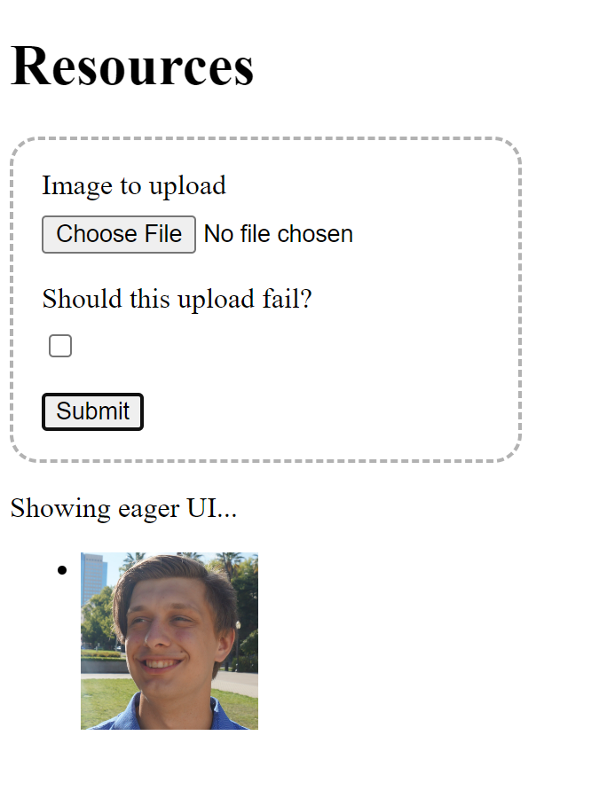

# TanStack Image Upload Eager UI Demo

A demo of a fake image upload service that shows an eager UI for image uploads.

This means that while the upload is still technically in progress, the UI will show the image as if it has already been uploaded.

> "Showing eager UI" is present to demonstrate when the UI is being eager or not

## Tech Used

- [TanStack Query](https://tanstack.com/query) - For managing the state of the app
- [MSW](https://mswjs.io/) - To mock the endpoints
